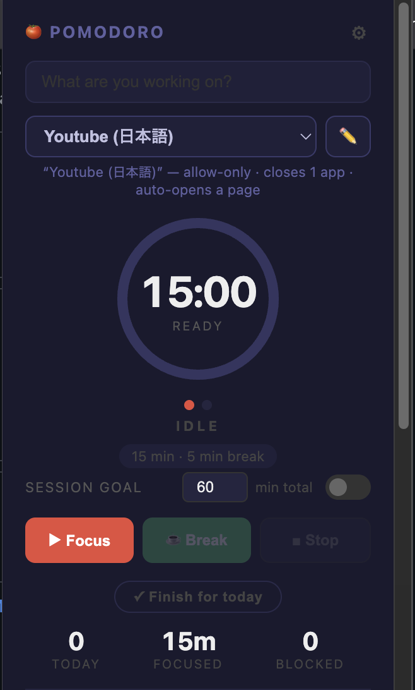

# 🍅 Pomodoro Blocker

A Chrome extension that blocks distracting websites during focus sessions.

  

## Features

- **25/5 Pomodoro timer** with long break (15 min) after every 4 sessions
- **Site blocking** — blacklist sites that redirect to a focus page during work
- **Whitelist exceptions** — e.g. block `youtube.com` but allow `music.youtube.com`
- **Allow-only mode** — block everything except a chosen set of sites
- **Presets** — saved profiles (e.g. "Manga") that set the block mode, site list,
  apps to close, and an optional URL to auto-open when you press Focus
- **App blocking (macOS)** — quits chosen apps during focus via a native helper
  (see [`native-host/`](native-host/))
- **Strict mode** — requires 10 clicks + a written reason to stop a session early
- **Task label** — set what you're working on, shown on the blocked page
- **Ambient sounds** — rain, white noise, or brown noise while you work
- **Break suggestions** — quick exercises (push-ups, squats, etc.) during breaks
- **Weekly heatmap** — GitHub-style grid of your daily focus minutes
- Configurable durations, auto-start, session stats

## Installation

1. Clone or download this repo
2. Open `chrome://extensions/`
3. Enable **Developer mode** (top right)
4. Click **Load unpacked** and select the folder

## Usage

1. Add sites to **Blocked sites** (e.g. `reddit.com`, `youtube.com`)
2. Optionally add exceptions to **Always allowed** (e.g. `music.youtube.com`)
3. Type what you're working on and hit **▶ Focus**
4. Get redirected if you try to visit a blocked site
